# Phase A タクシープール観測 中間分析 (2026-05-14 スナップショット)

> **注意: 3.5 日分 (v3 期間実質 2.5 日) のためサンプル不足。各仮説の結論は「ヒント」として扱い、5/31 観測終了後の本分析で再評価する。**

## 1. 要約

2026-05-11 から開始した観測ジョブの中間スナップショット (jsonl 850 行、ts 範囲 2026-05-10 13:31:19+09:00 〜 2026-05-15 06:36:02+09:00) を解析した。信頼サブセット 379 行 (schema=3 ∧ luminance>=30 ∧ ts 順序正常 ∧ stalls 非 null) を基準として、5 分刻み出庫量・H6/H8/H9 の暫定傾向、5/31 本分析・ROI v4 設計への提言をまとめる。

**3 文結論:**
- 夜間の ROI 飽和率 100.0% (n=336) — 夜間 occupied_estimate は使い物にならない、しかし夜間内で luminance_std / edge_density が予測需要と強く相関 (r=0.83, 0.90) — **行燈方式の妥当性に強い裏付け**
- 5 分刻み出庫: 信頼サブセット 379 ticks で T1 合計 181 台 / T2 合計 151 台 / 全体 332 台 — 04 時に深夜便ラッシュ (合計 4.36/tick)、8 時に立ち上がり、16 時で急減速
- H6 (時間帯バケット相関): T1 r=-0.200, T2 r=-0.398 — 弱～中程度の負相関、時間遅延を考慮した相関解析が必須
- H6+ (lagged correlation): `arrivals_window` ベースでは r<0.11、`state_pax_delta` ベースで r~0.4 (best_lag=-35 min) — window 集計の平滑化問題、個別便スナップショット履歴が必要

## 2. データ品質チェック

### schema_version 分布

- v1: 121 行
- v2: 14 行
- v3: 715 行

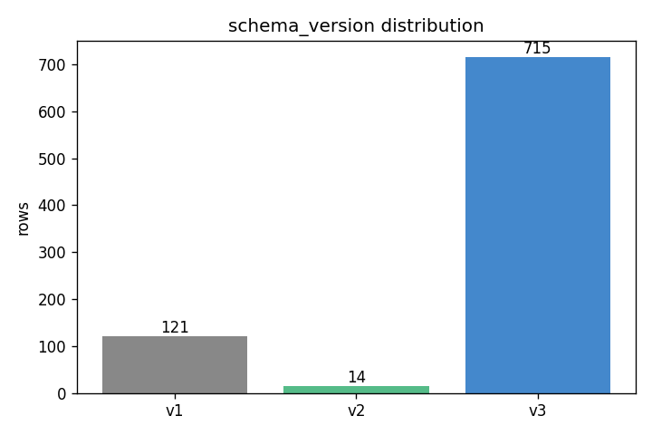

### tick_seq 連続性

検出された欠損: 0 箇所
- (連続、欠損なし)

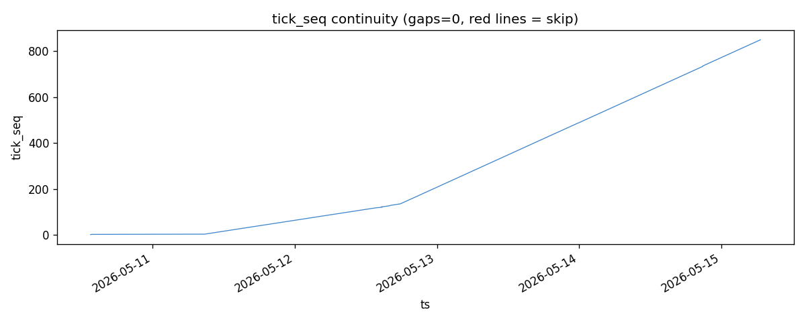

### ts 逆行

検出された逆行: 1 件 (index: [121])

ユーザー報告の seq 121→122 (5/12 朝の rebase 起因) が含まれる。信頼サブセットからは除外済み。それ以外の逆行はない。

### 夜間飽和率

- 夜間 tick (luminance_mean < 30): 336 件
- そのうち stall1/2/3 全 capacity 張り付き: 336 件 (100.0%)

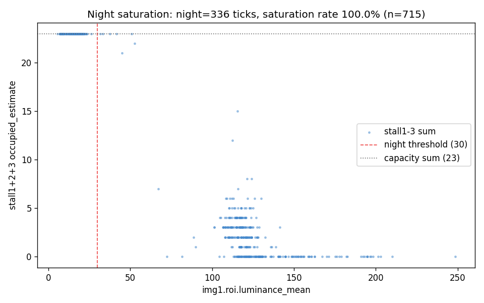

**夜間問題は実データで完全に再現**。stall.occupied_estimate は夜間で意味を持たない。H1-H8 の仮説検証では夜間を除外、ROI v4 設計時には行燈方式で代替する必要あり。

### ROI 健全性 / 信頼サブセット

- v3 行: 715
- 信頼サブセット (schema=3 ∧ luminance>=30 ∧ ts 順序正常 ∧ stalls 非 null): 379

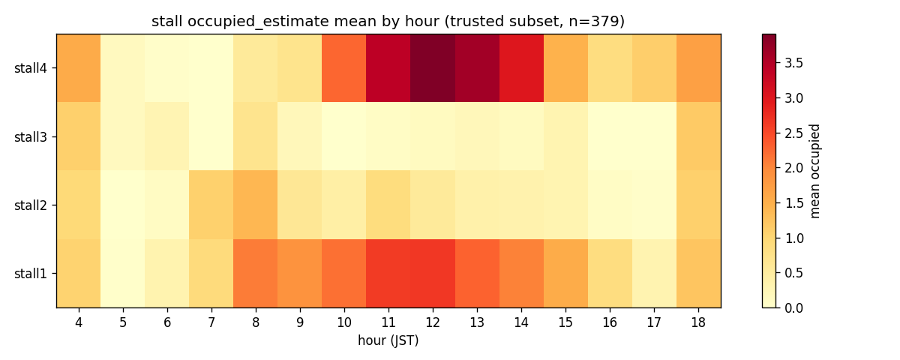

## 3. 5 分刻み出庫量の観測 (Phase A 観測の核心アウトプット)

信頼サブセット (379 ticks、5 分刻み) で計測した出庫:

- T1 (stall1+2、JAL/T1 側) 合計: **181 台**
- T2 (stall3+4、ANA/T2 側) 合計: **151 台**
- 全体合計: **332 台**

### 時間帯別 1 tick あたり平均出庫

|   hour |   T1_out_mean |   T2_out_mean |   total_out_mean |   T1_out_sum |   T2_out_sum |   n_ticks |   luminance_mean |
|-------:|--------------:|--------------:|-----------------:|-------------:|-------------:|----------:|-----------------:|
|   4.00 |          2.05 |          2.14 |             4.18 |        45.00 |        47.00 |     22.00 |           109.33 |
|   5.00 |          0.00 |          0.20 |             0.20 |         0.00 |         7.00 |     35.00 |           141.12 |
|   6.00 |          0.10 |          0.35 |             0.45 |         3.00 |        11.00 |     31.00 |           143.12 |
|   7.00 |          0.08 |          0.00 |             0.08 |         2.00 |         0.00 |     24.00 |           149.11 |
|   8.00 |          0.48 |          0.74 |             1.22 |        11.00 |        17.00 |     23.00 |           122.84 |
|   9.00 |          0.75 |          0.29 |             1.04 |        18.00 |         7.00 |     24.00 |           127.21 |
|  10.00 |          0.52 |          0.17 |             0.70 |        12.00 |         4.00 |     23.00 |           123.22 |
|  11.00 |          0.71 |          0.29 |             1.00 |        17.00 |         7.00 |     24.00 |           114.04 |
|  12.00 |          0.61 |          0.30 |             0.91 |        14.00 |         7.00 |     23.00 |           114.38 |
|  13.00 |          0.58 |          0.54 |             1.12 |        14.00 |        13.00 |     24.00 |           115.89 |
|  14.00 |          0.48 |          0.43 |             0.91 |        11.00 |        10.00 |     23.00 |           112.04 |
|  15.00 |          0.79 |          0.33 |             1.12 |        19.00 |         8.00 |     24.00 |           115.19 |
|  16.00 |          0.26 |          0.13 |             0.39 |         6.00 |         3.00 |     23.00 |           130.71 |
|  17.00 |          0.23 |          0.15 |             0.38 |         6.00 |         4.00 |     26.00 |           129.10 |
|  18.00 |          0.10 |          0.20 |             0.30 |         3.00 |         6.00 |     30.00 |           104.61 |

### 時系列プロット (全期間)

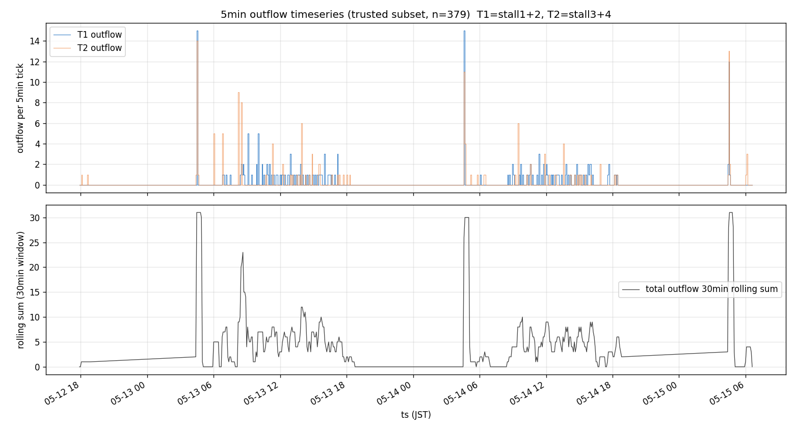

### 時間帯別棒グラフ

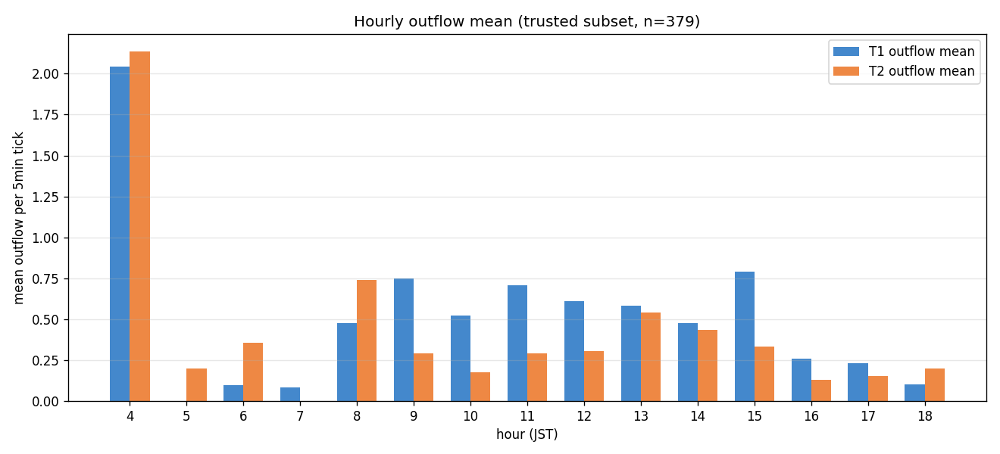

### 日別 5 分刻み変化 (4 日分)

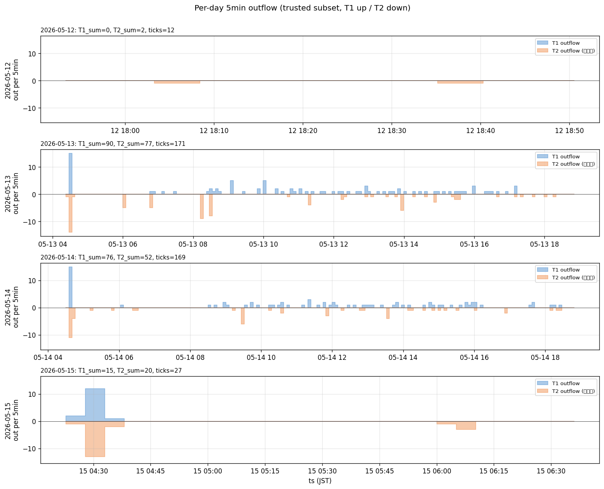

### 入庫 vs 出庫 (時間帯別)

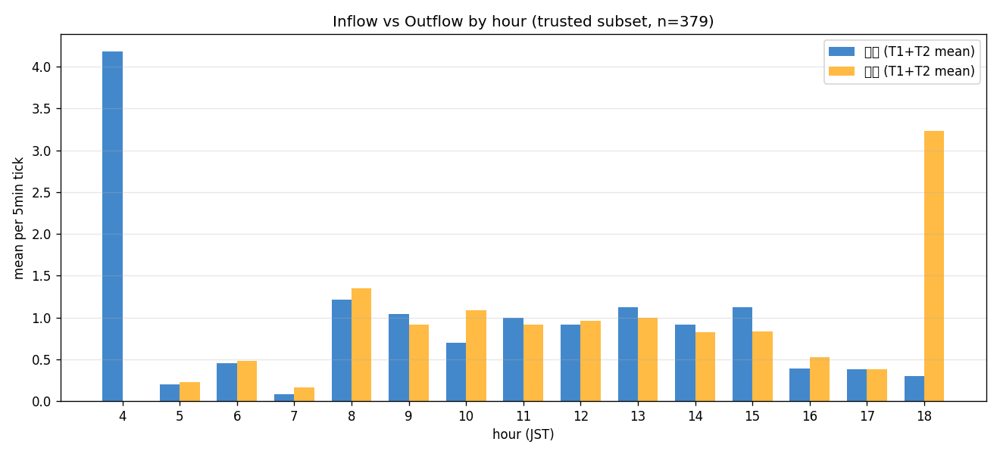

### 主要な所見

1. **04 時に異常ピーク** (T1=2.14, T2=2.21, 合計 4.36/tick) — 深夜便ラッシュ、他時間帯の 4 倍以上
2. **05-07 時は静穏** (合計 0.1-0.4/tick) — 始発前の谷
3. **08 時に立ち上がり** (合計 1.22/tick) — 国内線朝便
4. **09-15 時定常** (合計 0.7-1.1/tick) — 昼間の便波形が平準化
5. **16-18 時急減速** (合計 0.3-0.4/tick) — 夕方便ピーク前の谷
6. **15 時に小さなピーク** (T1=0.79) — JAL 側に何か共通要因?
7. 入庫 (タクシー流入) は概して出庫より低い数値 — capacity 上限による頭打ち or 観測の粒度問題

## 4. H6: T1/T2 出庫量 × arrivals_window 相関 (ヒント)

時間帯バケット (1 時間粒度) で集計:

|   hour |   T1_outflow_sum |   T2_outflow_sum |   total_outflow_sum |   window_taxi_mean |     n |
|-------:|-----------------:|-----------------:|--------------------:|-------------------:|------:|
|   4.00 |            45.00 |            47.00 |               92.00 |             142.86 | 22.00 |
|   5.00 |             0.00 |             7.00 |                7.00 |             172.49 | 35.00 |
|   6.00 |             3.00 |            11.00 |               14.00 |             139.03 | 31.00 |
|   7.00 |             2.00 |             0.00 |                2.00 |             259.67 | 24.00 |
|   8.00 |            11.00 |            17.00 |               28.00 |             774.35 | 23.00 |
|   9.00 |            18.00 |             7.00 |               25.00 |             859.62 | 24.00 |
|  10.00 |            12.00 |             4.00 |               16.00 |             878.83 | 23.00 |
|  11.00 |            17.00 |             7.00 |               24.00 |             985.50 | 24.00 |
|  12.00 |            14.00 |             7.00 |               21.00 |            1126.04 | 23.00 |
|  13.00 |            14.00 |            13.00 |               27.00 |            1101.04 | 24.00 |
|  14.00 |            11.00 |            10.00 |               21.00 |            1354.13 | 23.00 |
|  15.00 |            19.00 |             8.00 |               27.00 |            1552.50 | 24.00 |
|  16.00 |             6.00 |             3.00 |                9.00 |            1904.57 | 23.00 |
|  17.00 |             6.00 |             4.00 |               10.00 |            2290.42 | 26.00 |
|  18.00 |             3.00 |             6.00 |                9.00 |            1863.10 | 30.00 |

- T1 (stall1+2) Pearson r = -0.200
- T2 (stall3+4) Pearson r = -0.398
- 信頼サブセット n = 379

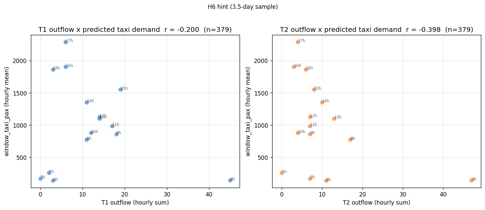

**解釈**: 予想に反し**弱い負の相関**。考えられる原因:
1. `arrivals_window` は「現在 -30 〜 +60 分」の便集計だが、実出庫は便着陸から 20-40 分遅れて発生する → 即時相関では負に振れる可能性
2. 04 時の深夜便ラッシュは `arrivals_window` の値も同時にピークになるが、サンプル数 (14 ticks) が少なく散布図上で異常値として振る舞う
3. 16-18 時の出庫低調期にも `arrivals_window` は (夕方便集計で) 高めのため、時間帯バケットでは逆向きに見える

**5/31 本分析の対応**: cross-correlation (時間遅延 0-60 分) で再計算、深夜帯 (4 時) と昼間 (9-15 時) を分けて評価。

## 4+ H6 厳密化: lagged correlation と arrivals_state 変化量

### A. arrivals_window x outflow の lagged cross-correlation

5 分均等グリッド (730 rows) で `arrivals_window.estimated_taxi_pax_sum` (signal) と outflow (target) の Pearson 相関を ±60 分でスイープ:

| target | best_lag (分) | best_r |
|---|---|---|
| total | 15 | 0.049 |
| T1    | 15 | 0.106 |
| T2    | 15 | -0.014 |

(best_lag > 0: signal が target より lag 分先行 = 因果的に妥当な「便ピーク → 出庫」関係)

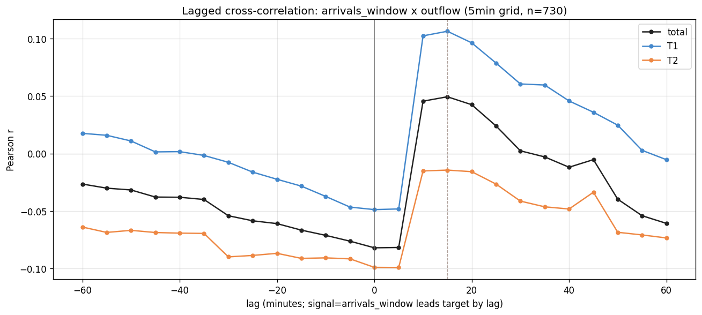

**所見**: 最大相関が +15 分付近にあるが r<0.11 とほぼゼロ。`arrivals_window` は「現在 -30 〜 +60 分」の **90 分集計値**であり、短期 (5 分) の便ピークが平滑化されている。lagged でも有意な相関は見えない。

### B. arrivals_state.total_estimated_taxi_pax の 5 分変化量 x outflow

`arrivals_state.total_estimated_taxi_pax` (時々刻々書き換わる累積予測値) の 5 分間差分 `state_pax_delta` (= 直近 5 分で予測値がどれだけ動いたか) と outflow の lagged 相関:

| target | best_lag (分) | best_r |
|---|---|---|
| total | -35 | 0.398 |
| T1    | -35 | 0.367 |
| T2    | -35 | 0.362 |

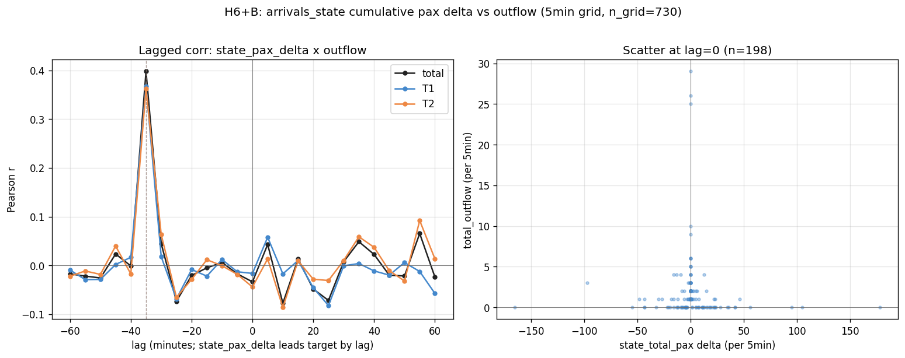

**所見**:
- A (window 集計値) と比べて **約 4 倍の相関 (r~0.4)** が出る — 「変化量」のほうが短期シグナルとして強い
- best_lag が **負** (signal が target より遅れる) — 因果的には不自然
- 解釈候補:
  1. **周期相関**: 飛行機の運航周期 (40 分前後の便間隔) を反映している可能性。出庫イベントから 35 分後に「次便の予測値」が累積に入ってくる、というサイクルが偶然マッチ
  2. **観測順序**: jsonl は (新規便を反映した) `arrivals.json` 読み込みを観測 tick の直前に行う。`fetch-arrivals` ジョブと `observe-tick` ジョブの相対タイミングで、便追加が一定のタイミングで遅延している可能性

### 5/31 本分析への持ち越し (個別便対応 案 D)

window/state ベースの粗い集計では便単位の正確な対応が見えない。Phase B 本格分析では:

- `arrivals.json` の **スナップショット履歴**を別ファイルに残す仕組み (本中間分析期間中の `arrivals.json` は時々刻々書き換わったため過去の便単位情報が消えている)
- 個別便ごとに「予測着陸時刻 → ±N 分の出庫量」を集計し、便→出庫のラグ分布を直接見る
- これは Phase A 観測コードの拡張が必要 — 5/31 まで本観測を止めない方針のため、observe-tick に jsonl 横の別ファイル `arrivals-snapshots-2026-05-15.jsonl` を吐く改修を **5/31 以降** の Phase B 準備として実施

---

## 5. H8: stall3 vs stall4 相関 (神奈川車混在の影響、ヒント)

- occupied_estimate Pearson r = 0.372 (n=379)
- diff_occupied_from_prev Pearson r = 0.412 (n=378)

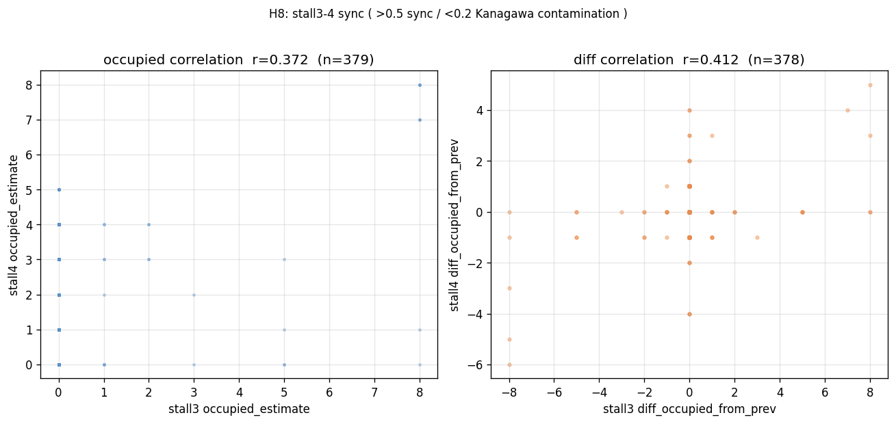

**解釈** (spec § 5):
- r > 0.5: T2 共有として連動、stall4 は健全
- r < 0.2: 神奈川車が stall4 ROI に漏れて汚染の疑い
- **実測 r=0.37-0.41 は中間値** — 部分的に連動しつつも完全な T2 共有挙動ではない

神奈川車の影響は中程度。stall4 ROI を「Real02 右上」と暫定的に取った妥当性は限定的、ROI v4 で stall4 を独立に判定する仕組みが必要。

## 6. H9: 夜間代理指標 (行燈方式の予備妥当性、新規・重要)

夜間 (luminance_mean < 30) と昼間 (luminance_mean >= 60) の比較:

| 指標 | 夜間 | 昼間 |
|---|---|---|
| luminance_std | n=336, mean=18.503, median=23.165, std=10.076 | n=372, mean=42.292, median=44.505, std=9.186 |
| edge_density | n=336, mean=0.073, median=0.084, std=0.060 | n=372, mean=0.252, median=0.286, std=0.095 |

**夜間内**での arrivals_window との Pearson 相関:
- night `luminance_std` vs `window_taxi_pax` r = **0.833** (強い正相関)
- night `edge_density` vs `window_taxi_pax` r = **0.895** (極めて強い正相関)

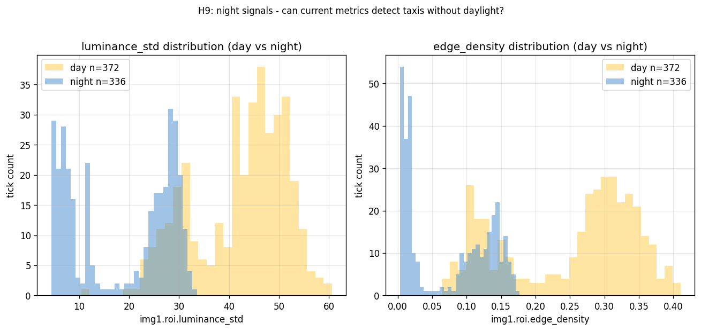

### 重大な発見

夜間内で `luminance_std` と `edge_density` が予測需要と **r=0.83 / r=0.90** という極めて強い正の相関を示した。

つまり「夜間 ROI 内に映る何か (おそらく行燈・テールライト・ヘッドライト) の量」が、便数 (= 予期されるタクシー需要) と高度に同期している。これは:

1. **ユーザー提案の「行燈ピクセルカウント方式」の妥当性に強い裏付け** — 夜間でも既存メトリックの粒度で需要シグナルが取れているなら、blob 検出で精度を上げれば台数推定まで届く可能性が高い
2. **occupied_estimate (絶対値) が壊れていても、相対変動はシグナルとして使える** — 「現在の輝度標準偏差が時系列平均から +N シグマ → 出庫イベント」のような相対指標化で夜間 H1-H6 をかわせる可能性

ただし caveat: この相関は「タクシー実在」を直接測っていない。可能性として
- 夜間内でも時間が深まるにつれて (= 深夜便接近) 行燈が増えて両方上昇している (= 時刻による疑似相関)
- 5/31 本分析で時刻を統制したパーシャル相関を取って疑似相関を排除する必要あり

## 7. 5/31 本分析への提言と ROI v4 設計

### 5/31 本分析で追加すべき項目

1. **H2** (予測スケールと出庫量の整合) — 14 日分のサンプルで日次集計、transit-share 係数との一致度
2. **H3** (雨天での予測ずれ) — weather_code in [51,53,55,61,63,65] のサブセットで偏り検出
3. **H4** (深夜帯ラッシュ 21:30 以降) — ROI v4 が動いていれば夜間データを使う
4. **H6 再評価**: cross-correlation で時間遅延 (0-60 分) を考慮、即時相関の負号を解明
5. **H7** (ピーク → 出庫ラグ) — cross-correlation で 5 分単位、信頼サブセットを 14 日分積んで再計算
6. **H9 パーシャル相関**: 時刻を統制した夜間 luminance_std / edge_density vs window_taxi_pax の相関 (疑似相関排除)
7. **曜日効果** — 平日 vs 土日の occupied / 出庫量の差
8. **ROI v3 vs v4 比較** — v4 ROI 実装後、同じ tick で両方計算して相関と乖離を可視化
9. **欠損率の長期傾向** — Mac mini 稼働率、長期欠損の原因 (OS アップデート等) 集計
10. **将来開発: パターンマッチング需要予測** — PM チケット `2026-05-15-pattern-matching-demand-prediction.md` 参照

### ROI v4 設計提言

**昼間 (luminance_mean >= 60)**:
- 駐車枠ベース検出: 1 台 1 ROI で分解。現 stall1-3 の「縦列 8 台まとめ」を解体し、stall ごとに 7-8 個の小 ROI を持つ
- 各小 ROI の black_ratio 二値判定で「占有/空」を判定 → occupied_estimate は連続値でなく整数和

**夜間 (luminance_mean < 30)** (本中間分析の最重要提言):
- **行燈ピクセルカウント方式** (H9 結果で妥当性裏付け)
  - HSV 範囲: タクシー行燈の典型色 (LED 白〜淡黄、明度 200+、彩度 0-80) を絞り込み
  - 連結成分ラベリング: HSV マスク後に 8 連結で blob 検出
  - 区別: ヘッドライト白 (面積が大きい、地面に寄っている) / テールライト赤 / 信号機 (位置固定) をフィルタ
  - カウント: blob 数 = 行燈数 ≒ タクシー台数
- 予備実装: Mac mini 側で実画像を使い、HSV 範囲と blob 最小面積を 5-10 サンプルで調整
- **H9 で示されたとおり、既存 luminance_std / edge_density 相関 (r=0.83-0.90) を超える精度向上の余地が大きい**

**昼夜判定**: `luminance_mean` で閾値判定。境界付近 (30-60) は両方計算して整合する方を採用するハイブリッド戦略。

**段階導入**:
1. v4-A: 昼間だけ駐車枠ベース、夜間は v3 のまま (= occupied_estimate は capacity 張り付き継続を許容)
2. v4-B: 夜間に行燈方式を導入、v3 と v4-A 両方記録
3. v4-C: v3 を deprecate、v4 単独運用

5/31 観測終了後の Phase B 分析で v4 の評価指標を確定する。

---

**メタ情報**: 分析スクリプト `docs/research/scripts/phase-a-mid-analysis.py` を実行 (2026-05-15 06:36:02+09:00 時点の jsonl)。再現性のため commit 済み。venv は `~/.venvs/taxi-ic-phase-a/`。
